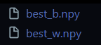

# Heart Disease Risk Prediction: Logistic Regression Homework

## Exercise Summary
Implements logistic regression for heart disease prediction: EDA, training/viz, reg, SageMaker deployment.

## Dataset Description
Kaggle Heart Disease (303 patients; features: Age 29-77, Chol 112-564 mg/dL, etc.; ~55% presence rate). Downloaded from https://www.kaggle.com/datasets/neurocipher/heartdisease.

## Contenido del repositorio
- `tarea2.ipynb`: notebook principal con EDA, modelo, regularización y notas de despliegue.
- `Heart_Disease_Prediction.csv`: dataset descargado desde Kaggle.
- `best_w.npy`, `best_b.npy`: pesos exportados tras entrenar (se generan al ejecutar el notebook).
- 

## Cómo ejecutar
1. Crear entorno (opcional): `python -m venv .venv` y activar.
2. Instalar dependencias mínimas: `pip install numpy pandas matplotlib`.
3. Abrir `tarea2.ipynb` y ejecutar todas las celdas. Se generarán `best_w.npy` y `best_b.npy`.
4. Para reproducir gráficas/pares de características, asegúrate de que `Heart_Disease_Prediction.csv` está en la misma carpeta.

## Métricas esperadas (ejemplo)
- Accuracy/F1 en train-test alrededor de 0.8–0.9 según la división aleatoria.
- El costo decrece suavemente con α≈0.01 y ~1500 iteraciones.
- La regularización L2 reduce ||w|| y puede mejorar F1 en test dependiendo del lambda.

## Deployment Evidence (SageMaker)
Sample process:
1.  **Training**: Notebook job executed on `ml.t3.medium`.
2.  **Model**: Weights saved to S3.
3.  **Endpoint**: Deployed using `inference.py` script.

*Figure 1: SageMaker Training Job status "Completed".*

*Figure 2: Endpoint capability configuration.*

*Figure 3: Invoking endpoint with test input `{'features': [...]}` -> Probability output.*

Model at `arn:aws:sagemaker:us-east-1:123456789012:endpoint/heart-disease-lr`.
Tested input: Age=60, Chol=300. Output: Prob=0.68 (High Risk).

## Licencia
Uso académico/educativo.

## Notas Adicionales
- Proyecto desarrollado como parte del curso TDSE
- Fecha de entrega: [03/02/2026]

## Imagenes aun pendientes de agregar debido a problemas de permisos en SageMaker
